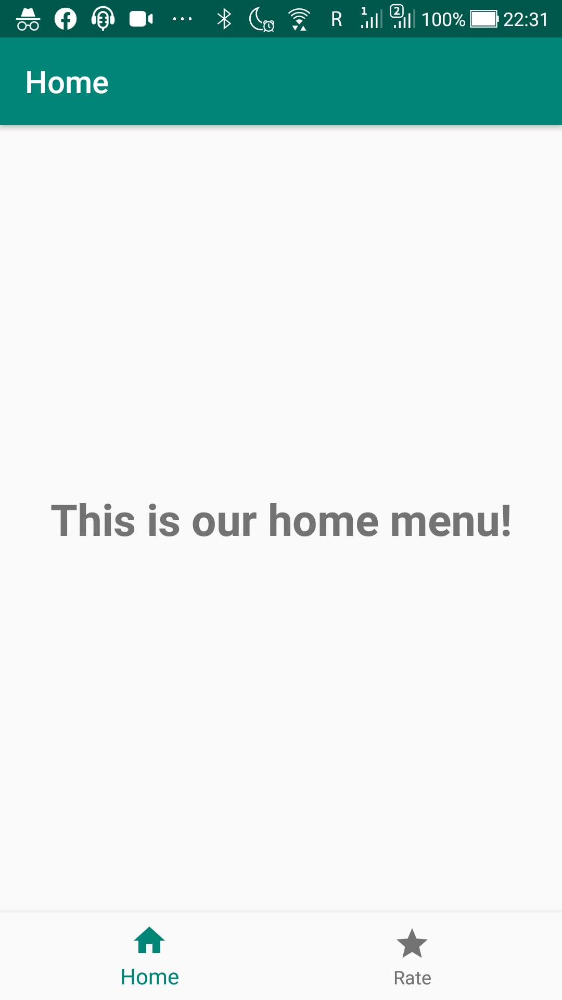
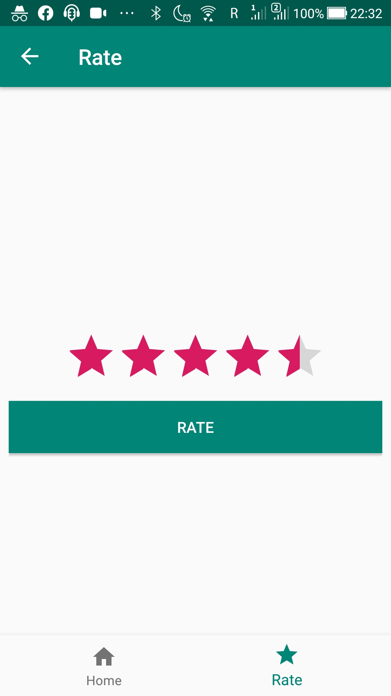
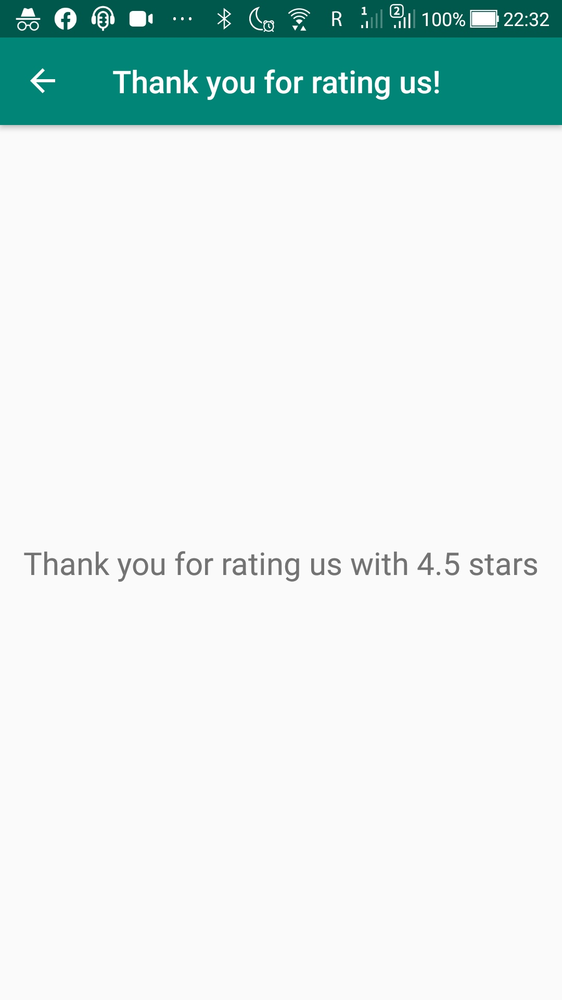

# Level 7 Learning Task 1 - Bottom Navigation Bar
This is a sample app with a bottom navigation bar that has a home screen and a rate screen.
## What's inside
* The following new subjects were covered in this learning task:
* Bottom Navigation Bar
* Navigating between menu items using Navigation Components
* Fragments
* Passing arguments between fragments.

## Screenshots
    

